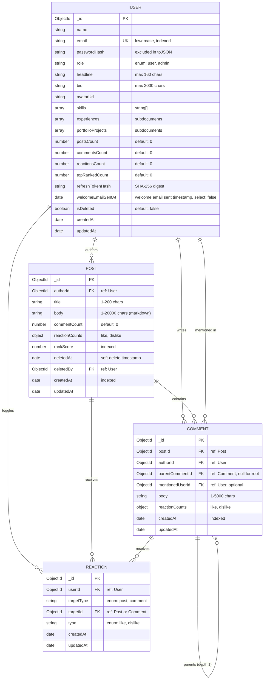

# DevPulse Database Architecture & Entity Relationship Diagram

This document specifies the current MongoDB document schemas, indexing strategies, relationships, and transactional boundaries implemented in DevPulse via Mongoose.

---

## 1. Entity-Relationship Diagram

---

## 2. Schema Specifications & Field Details

### 2.1. User Schema (`User`)
* **Collection**: `users`
* **File**: `backend/src/users/schemas/user.schema.ts`
* **JSON Serialization**: Maps `_id` $\rightarrow$ `id`, strips `__v` and `passwordHash`.
* **Subdocument: Work Experience (`ExperienceSchema`)**:
  * `title`: string (required)
  * `company`: string (required)
  * `from`: Date (required)
  * `to`: Date or null
  * `current`: boolean (default `false`)
  * `description`: string (optional, max 2000 chars)
* **Subdocument: Portfolio Project (`PortfolioProjectSchema`)**:
  * `title`: string (required, max 100 chars)
  * `description`: string (required, max 1000 chars)
  * `projectUrl`: string (optional URL)
  * `repositoryUrl`: string (optional URL)
  * `tags`: string[] (min 1, max 20 items)
* **Indexes**:
  * `{ email: 1 }` (unique, lowercase, sparse)
  * `{ role: 1 }` (for admin filter queries)
  * `{ isDeleted: 1 }` (for soft-deleted user filtering)
* **Idempotency & Email Lifecycle**:
  * `welcomeEmailSentAt`: Date or null (default `null`, `select: false`, marks successful dispatch of welcome email)

### 2.2. Post Schema (`Post`)
* **Collection**: `posts`
* **File**: `backend/src/posts/schemas/post.schema.ts`
* **JSON Serialization**: Maps `_id` $\rightarrow$ `id`, strips `__v`.
* **Reaction Counters**:
  * `reactionCounts.like`: number (default `0`, non-negative)
  * `reactionCounts.dislike`: number (default `0`, non-negative)
* **Ranking Score Algorithm**:
  $$\text{rankScore} = (\text{likes} - \text{dislikes}) + (\text{commentCount} \times 2)$$
* **Indexes**:
  * `{ createdAt: -1, _id: -1 }` — chronological feed sorting (`sort=latest`)
  * `{ rankScore: -1, createdAt: -1, _id: -1 }` — top-ranked feed sorting (`sort=top`)
  * `{ commentCount: -1, createdAt: -1, _id: -1 }` — discussion feed sorting (`sort=most-discussed`)
  * `{ title: "text", body: "text" }` — full-text search indexing with weights (`title: 5, body: 1`)
  * `{ deletedAt: 1 }` — sparse index for hourly cron purge task (`purgeExpiredPosts`)

### 2.3. Comment Schema (`Comment`)
* **Collection**: `comments`
* **File**: `backend/src/comments/schemas/comment.schema.ts`
* **JSON Serialization**: Maps `_id` $\rightarrow$ `id`, strips `__v`.
* **Hierarchy Enforcement**:
  * Top-level comments have `parentCommentId: null`.
  * Replies have `parentCommentId: <ObjectId>` pointing to the top-level root comment.
  * Multi-depth nesting (>1 level) is rejected at the controller/service boundary with `400 Bad Request`.
  * Replies to replies preserve conversational context by specifying `mentionedUserId` rather than nesting further.
* **Indexes**:
  * `{ postId: 1, parentCommentId: 1, createdAt: 1 }` — optimized single-query tree retrieval
  * `{ authorId: 1 }` — author query performance

### 2.4. Reaction Schema (`Reaction`)
* **Collection**: `reactions`
* **File**: `backend/src/reactions/schemas/reaction.schema.ts`
* **Compound Unique Constraint**:
  * `{ userId: 1, targetType: 1, targetId: 1 }` (unique)
  * Ensures that a single user cannot submit multiple reactions to the same target entity simultaneously.
* **Indexes**:
  * `{ targetType: 1, targetId: 1, type: 1 }` — optimized reactors listing and filtering

---

## 3. Transactional Consistency & Concurrency Boundaries

### 3.1. Reaction Toggle Concurrency
* **Challenge**: Rapid double-clicking or simultaneous like/dislike clicks can cause race conditions where target counters (`reactionCounts.like` / `dislike`) drift from actual reaction records.
* **Mechanism**:
  1. Requests run inside a **MongoDB multi-document transaction** (`ClientSession`).
  2. Queries use the active session: `findOne({ userId, targetType, targetId }).session(session)`.
  3. Mutates `reaction` collection and atomically calls `$inc: { "reactionCounts.<type>": delta }` on the target post or comment.
  4. Wraps execution in an automatic retry loop (up to 3 attempts) catching MongoDB `TransientTransactionError` and write conflicts (error code `11000`).

### 3.2. Comment Creation & Deletion Cascades
* **On Create Comment**:
  * Atomically creates the `Comment` document.
  * Increments `Post.commentCount` by 1.
  * Increments `User.commentsCount` on the author by 1.
* **On Delete Comment**:
  * If deleting a **reply**: deletes single reply, decrements `Post.commentCount` by 1.
  * If deleting a **root comment**: atomically deletes the root comment and all associated replies (`parentCommentId: rootId`), decrementing `Post.commentCount` by `1 + repliesCount` within a single transaction.
